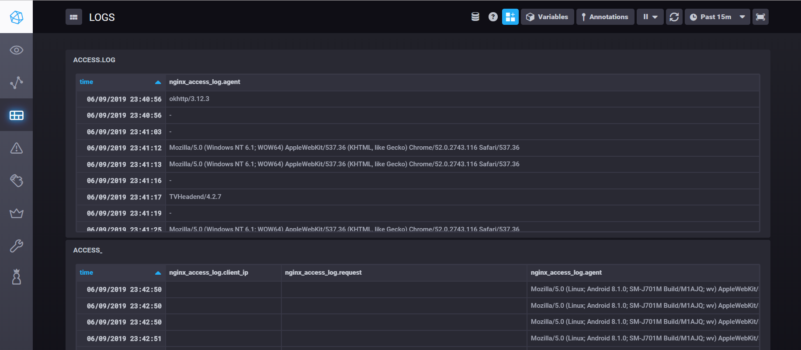

# docker-monitoring-sandbox
Monitor your server with the *TICK Stack* from InfluxData. The *TICK Stack* results in a platform composed of open source components which makes collection, storage, graphing and alerting on-time series data such as metrics and events easy.

## TICK Stack
Collectively, Telegraf, InfluxDB, Chronograf and Kapacitor are known as the TICK Stack.

> The TICK Stack is a loosely coupled yet tightly integrated set of open source projects designed to handle massive amounts of time-stamped information to support your metrics analysis needs.

### Telegraf
[Telegraf](https://influxdata.com/time-series-platform/telegraf/) is a plugin-driven server agent for collecting and reporting metrics.

### InfluxDB
[InfluxDB](https://www.influxdata.com/products/influxdb-overview/) is a time series database built from the ground up to handle high write and query loads. Is a custom high-performance datastore written specifically for time-stamped data, and especially helpful for use cases such as DevOps monitoring, IoT monitoring, and real-time analytics.

### Chronograf
[Chronograf](https://www.influxdata.com/time-series-platform/chronograf/) is the administrative user interface and visualization engine of the stack. Setup and maintain the monitoring and alerting for your infrastructure.

### Kapacitor
[Kapacitor]() is a native data processing engine. It can process both stream and batch data from InfluxDB. Kapacitor lets you plug in your own custom logic or user-defined functions to process alerts with dynamic thresholds, match metrics for patterns, compute statistical anomalies, and perform specific actions based on these alerts, like dynamic load rebalancing. 

## Setup
- Configure Docker Monitoring
  - Check Telegraf, in `docker-compose.yml`, has shared the docker daemon, [L.9](https://github.com/LaQuay/docker-monitoring-sandbox/blob/master/docker-compose.yml#L9)
  - Input should be set in `telegraf.conf`, [L.126-L.174](https://github.com/LaQuay/docker-monitoring-sandbox/blob/master/etc/telegraf.conf#L126-L174)
  - [More info](https://github.com/influxdata/telegraf/tree/master/plugins/inputs/docker)
- Configure NGINX Monitoring
  - Input should be set in `telegraf.conf`, [L.176-L.178](https://github.com/LaQuay/docker-monitoring-sandbox/blob/master/etc/telegraf.conf#L176-L178)
  - Add your URL with the `/metrics` endpoint.
  - [More info](https://github.com/influxdata/telegraf/tree/master/plugins/inputs/nginx)
- Configure Log parser Monitoring
  - Input should be set in `telegraf.conf`, [L.180-L.187](https://github.com/LaQuay/docker-monitoring-sandbox/blob/master/etc/telegraf.conf#L180-L187)
- Configure Google OAuth Login
  - Check Chronograf, in `docker-compose.yml`, fill the commented lines, [L.34-L.37](https://github.com/LaQuay/docker-monitoring-sandbox/blob/master/docker-compose.yml#L34-L37)
  - [More info](https://docs.influxdata.com/chronograf/v1.7/administration/managing-security/)

## Usage
After the setup, run `docker-compose up -d` and the full stack will be running in `YOUR_IP:8888`.

## Results
### Docker monitor

### Nginx monitor

### Logs monitor

## References
[InfluxData / TICK-docker](https://github.com/influxdata/TICK-docker)
[Infrastructure Monitoring with TICK Stack](https://blog.codeship.com/infrastructure-monitoring-with-tick-stack/)
